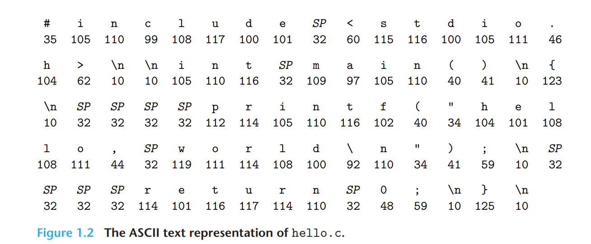
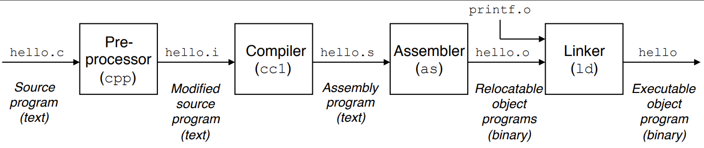
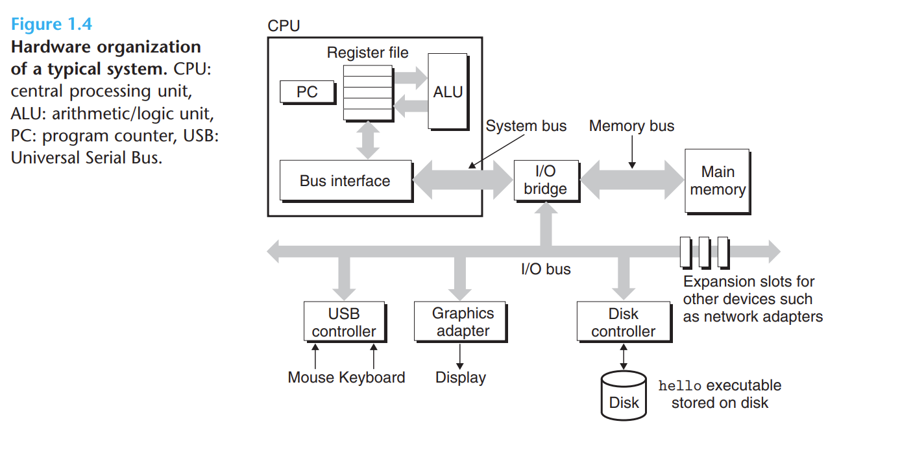
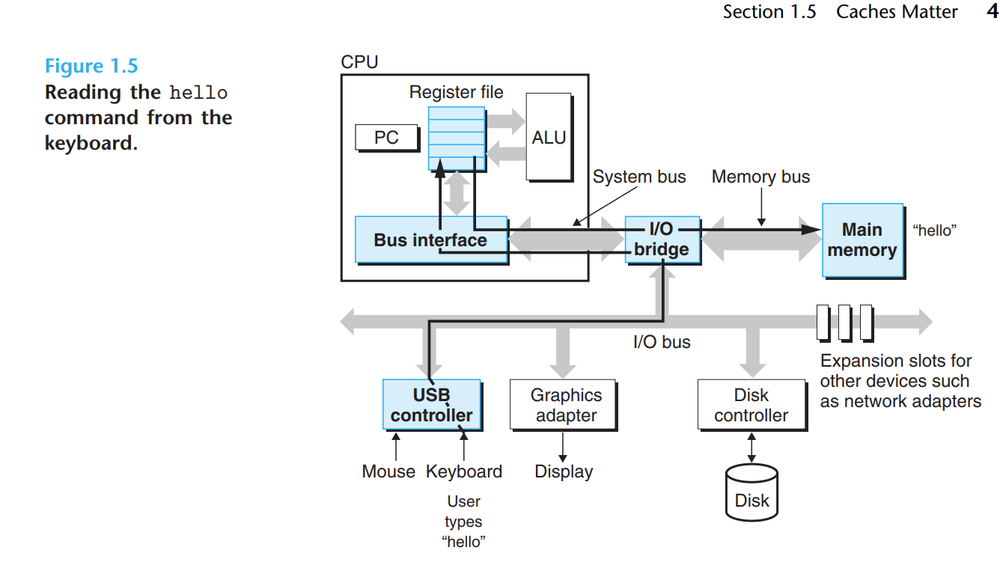
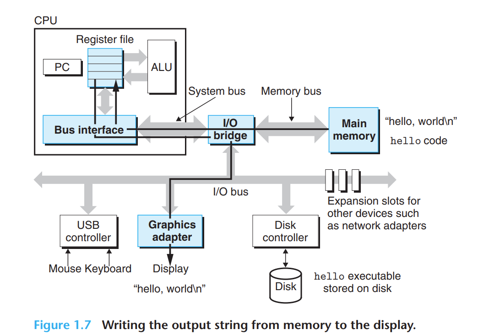
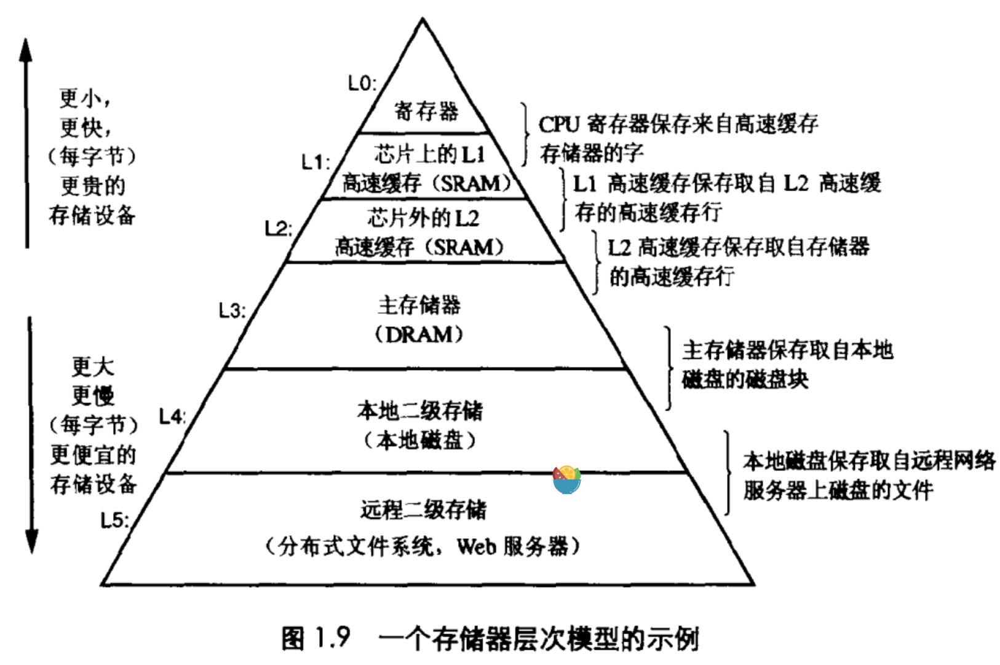
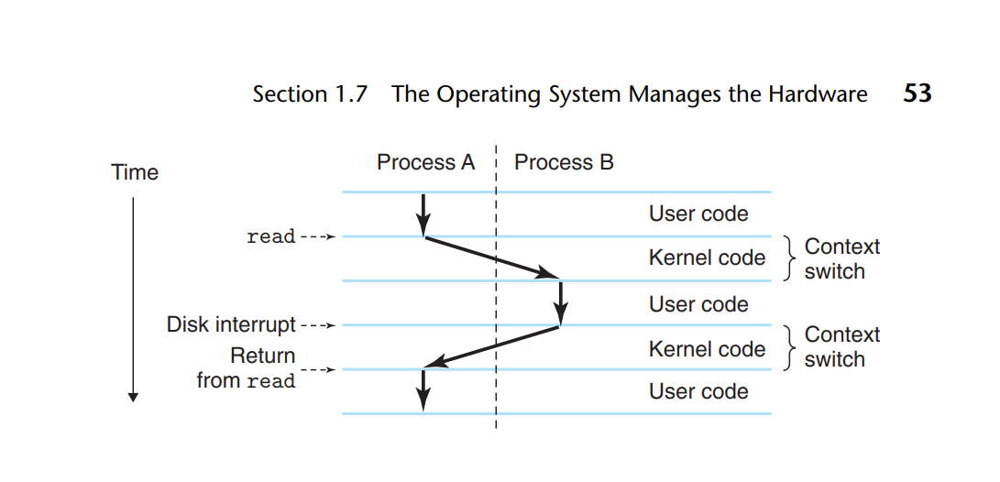
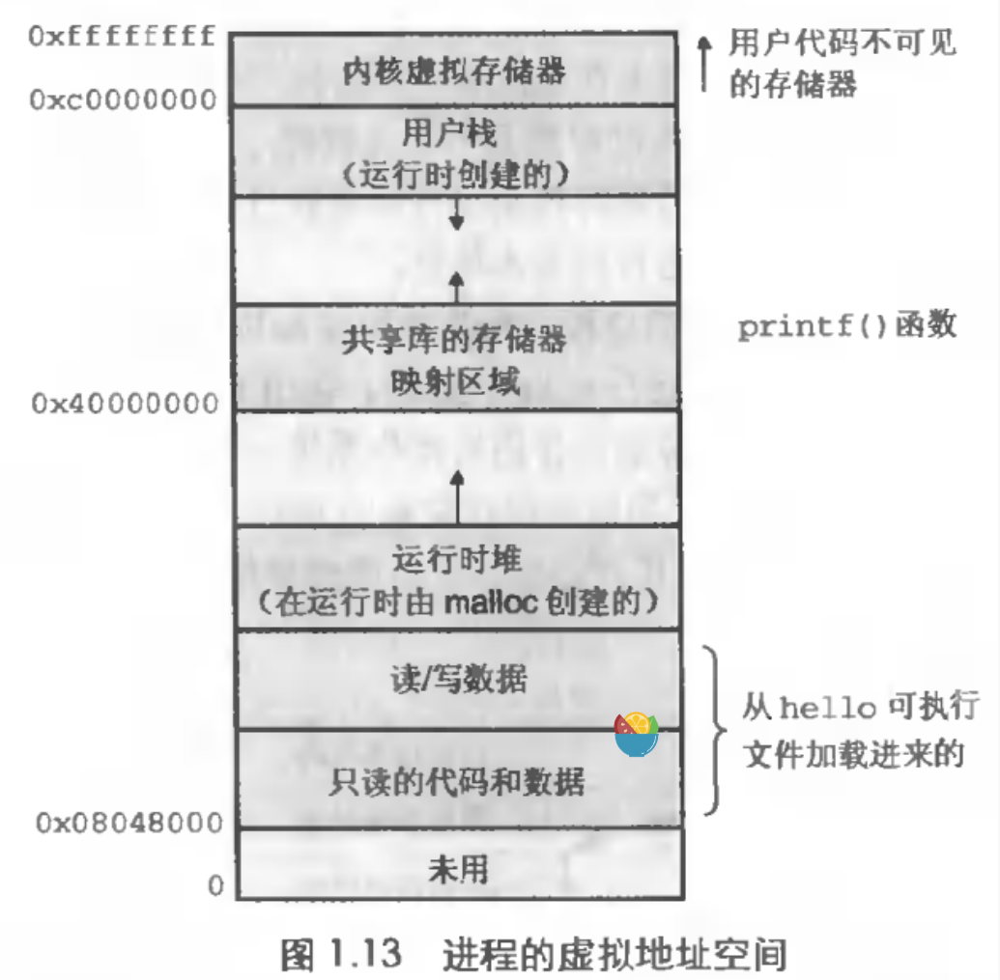

# 第一章 计算机漫游

> ​	本章是一个总的概述，从软件到硬件，整体串联介绍了一个hello world程序的运行过程

## 信息就是位加上下文

源程序实际上就是一个由0和1组成的位序列，通常我们将8位组成一组称为一个字节，每个字节表示程序中的某些文本字符。例如

可以看出所有的源文件都是以字节的序列的形式书写的。区分不同的数据对象的唯一方法就是我们读到的这些对象时的上下文（context）。

## 程序被其他翻译成不同的格式

一个高级语言写的程序（这里以C语言为例），从源代码到最终的机器中的可执行文件会经过一下四个阶段。

首先通过预处理器，经行预处理。这一步会将以字符`#`开头的命令修改原始的C程序，例如直接把引用的头文件的内容插入到文本中，以及经行宏展开等并得到了一个`.i`的文件

其次通过编译器，这一步会将预处理的内容生成汇编语言程序，并生成`.s`文件。

汇编阶段会将汇编程序翻译成二进制代码，生成的文件名后缀为`.o`。我们称其为可重定位目标程序

最后链接阶段，会将我们需要的其他的可重定位目标程序链接（例如，这里使用了`printf`函数，所以就需要连接`printf.o`）到一起最后生成一个可执行文件

## 处理器读并解释存储在存储器中的指令

经过上面的几个步骤，我们已经生成了可执行文件，如果要在unix上运行该文件，我们在shell中输入该文件名，即可执行，其细化的步骤为入下：

### 系统硬件组成

一个计算机系统的硬件主要由以下几个部分组成：

1. 总线，负责携带信息字节并在各个部件之间进行传输
2. I/O设备，负责系统和外界的联系
3. 主存，运行程序时存放程序以及程序中含有的数据
4. 处理器，解释（或执行）存储在主存中的指令

### 程序运行过程

初始的时候，shell程序执行它的指令，等待我们输入命令。随后，我们输入了字符串`./hello`之后，shell程序会将字符逐一读到寄存器，然后将其放到内存，如下所示：

我们输入完命令以后，按下回车之后，shell知道了我们结束了输入命令，然后它执行一系列指令，将hello程序的代码以及其数据加载到主存中。

当可执行文件加载到了主存中时，处理器就开始执行了hello程序，首先会从文件的开头`main`函数开始，逐步执行机械指令。具体而言，它会先将`"hello world\n"`字符串中的字节从主存，传输到寄存器文件，然后在由寄存器文件传输到输出设备中显示。如图

## 层次化的存储结构

由于当今半导体的发展，`cpu`的处理速度是很快的，往往限制程序运行的是一些`I/O`存取数据的操作，所以当前矛盾在于内存的读取速度。由此，设计了分层的缓存系统。由于程序在短时间内，处理的数据范围基本上很小，基于这一原则设计的分层系统，让高速的存储设备，存储少量的，最近使用过的数据，低一层次的设备，存储上一个设备最近使用过的文件，这样就很好的解决了数据传输慢的问题。

## 操作系统

我们在软件和硬件之间，设计了一个程序，从硬件视觉来看，它统一管理硬件资源，向上提供软件调用硬件资源的接口，方便统一化。从软件资源的角度来说，它解决了众多硬件接口不一致，无法统一所带来的代码编写困难的问题，为软件提供了良好的`API`接口，这就是操作系统。操作系统主要包括：进程，线程，虚拟内存和文件这几部分的内容

### 进程

进程是操作系统对一个正在运行的程序的抽象。一个单处理器系统任何时候都只能执行一个程序。由于上述所说，`CPU`的速度远大于数据读取操作的速度，我们利用进程这一个抽象的概念，将资源分配给进程，并由操作系统保持追踪进程所需的所有状态信息（称为上下文 ）。当一个进程，在经行读写操作的时候，`CPU`处于空闲状态，这个时候，我们将这个进程的上下文保存，并切换到下一个进程，这个时候，就能让`CPU`和内存读写，`I/O`设备同时工作起来，就能大幅度提升效率。

例如：

在单处理器上执行进程A,B。当A需要经行读写操作的时候，这个时候，我们通过一个特殊的函数（**系统调用函数**）让操作系统接管`CPU`，执行上下文切换之后，切换到进程B去执行相应的代码。如图所示

### 线程

进程是分配资源的单位。但是进程之间共享资源并不容易。因此，我们在进程中创建线程既能很好的实现多任务执行，又能方便的共享资源。

### 虚拟内存

虚拟内存是一个抽象概念，他给每个进程提供了一个假象，就是每个进程都独自占用主存。

因此，在每个进程的眼中，他们占用的内存都是一样的，称为虚拟地址空间。其结构如下：

- 程序代码和数据：对所有进程来说，代码的起始位置都一样，然后紧接着就是存放C全局变白了对应的数据位置
- 堆，可以动态扩展或者收缩，供像malloc和free这样的C语言中的库进行调用
- 共享库：大约在地址空间的中间部分，用于存放像C标准库和数学库这种共享代码的。
- 栈，可以动态扩展或者收缩，用于编译器的函数调用
- 内核虚拟存储器

### 文件

**文件就是字符序列。**在unix中一切皆文件，系统中的所有输入输出都是通过系统调用函数读写文件来实现的。

## 网络通信

网络可以看成一种特殊的`I/O`设备。计算机通过网络适配器，接入网络然后再通过分布在各地的网络设备，实现信息的交互。

